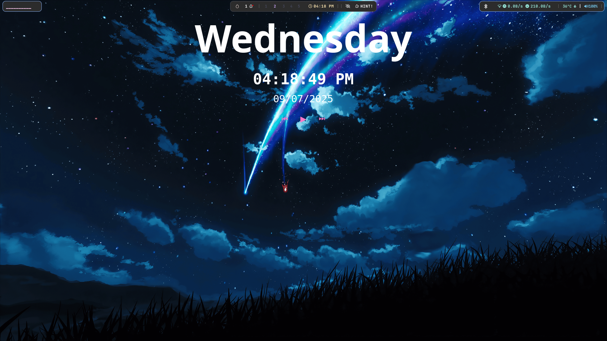

# 🌾 My Hyprland Rice

My personal dotfiles for Hyprland on Linux Mint with all essential apps and theming.

## Preview



## Features

- **Complete Hyprland setup** with waybar, rofi, dunst, hyprlock
- **Full app suite** - Steam, Discord, VS Code, Unity Hub, OBS, VLC, Krita, Bottles
- **Pywal theming** with automatic color generation for terminal
- **Zsh with Oh My Zsh** + Powerlevel10k + plugins
- **eww** built from source for widgets like the clock or player

## Installation

```bash
git clone https://github.com/yourusername/dotfiles.git
cd dotfiles
./install.sh
```

## What's Included

### Window Manager & UI
- Hyprland with custom configuration
- Waybar status bar
- Wofi/Rofi application launcher
- Dunst notifications
- Swaylock screen locker

### Applications
- **Gaming**: Steam, Lutris, Wine
- **Development**: VS Code, Unity Hub, Git
- **Media**: VLC, OBS Studio, Krita, Audacity
- **Communication**: Discord, Telegram
- **Utilities**: Bottles, Flameshot, Thunar
- **Terminal**: Kitty with Zsh + Oh My Zsh

### Theming
- Pywal automatic color generation
- GTK and Qt theme consistency
- Custom fonts (JetBrains Mono, Font Awesome)
- Papirus icons and Arc/Materia themes

### Shell Setup
- Zsh with Oh My Zsh
- Powerlevel10k theme
- Auto-suggestions, syntax highlighting
- Custom aliases and functions
- Cowsay welcome message

## Post-Installation

1. **Reboot** or log out and back in
2. **Start Hyprland** with `Hyprland` command
3. **Run `welcome`** to see your setup
4. **Generate pywal theme**: `wal -i ~/Pictures/wallpapers/yourwallpaper.jpg`
5. **Take a screenshot** and add it to the repo!

## Pywal Usage

```bash
# Generate theme from wallpaper
wal -i ~/Pictures/wallpapers/wallpaper.jpg

# Apply theme to running programs
source ~/.cache/wal/colors.sh

# Preview colors
wal --preview
```

## Updating Dotfiles

```bash
# Update from current system
./update.sh

# Commit changes
git add .
git commit -m "Update dotfiles"
git push
```

## Customization

- All configs are in `.config/` directory
- Wallpapers go in `wallpapers/` directory
- Custom scripts in `scripts/` directory
- Pywal cache preserved in `pywal/` directory

## Dependencies

The install script automatically handles:
- All Hyprland ecosystem packages
- Development tools and runtimes
- Media and gaming applications
- Python packages via pipx
- Flatpak applications
- Building eww from source

## Troubleshooting

- If apps don't appear: `sudo flatpak repair`
- If fonts missing: `fc-cache -fv`
- If themes not applied: restart session
- If eww build fails: install rust manually

## License

MIT License - Feel free to use and modify!

---

*"The best dotfiles are the ones you actually use"* 🌾
